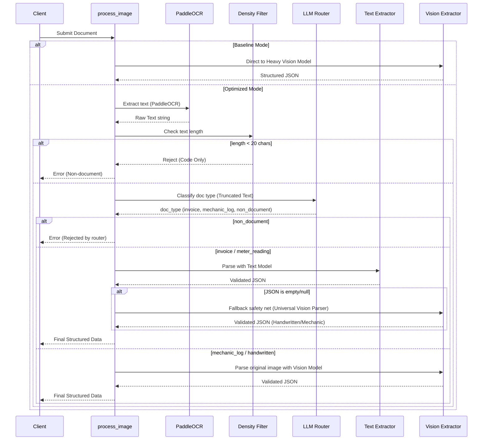

# System Design: Optera Document AI Pipeline

## What We Built

We designed a pipeline optimized for cost-efficiency without sacrificing accuracy.

**The Naive Baseline vs. Optimized Route:**
Instead of sending every image to a Heavy Vision LLM (like Gemini 2.5 Flash), which is expensive and slow, we decouple OCR from the extraction logic. 

**Pipeline Stages:**

```mermaid
flowchart TD
    A[Input Image] --> B[Preprocessing (OpenCV)]
    B --> C[OCR & Table Layout (PaddleOCR + PPStructure)]
    C --> D{Density Check}
    D -- < 20 chars --> E[Reject: Non-document (Free)]
    D -- >= 20 chars --> F[Truncate OCR & LLM Routing]
    F -- Invoice / Meter --> G[gpt-oss-120b Schema Parsing (Cheap)]
    F -- Handwritten / Mechanic --> H[Vision LLM Extraction (Fallback)]
    F -- Garbage Text --> I[Reject: Non-document (Cheap)]
    G --> J[Structured JSON Output]
    H --> J
```

1. **Preprocessing (OpenCV):** Resizing and grayscaling to ensure the OCR engine gets clean input.
2. **Text Extraction (PaddleOCR & PPStructure):** We use PaddleOCR as the unified engine to extract raw text, and PPStructure to extract tables as raw HTML strings.
3. **Density Check (Zero-cost filtering):** We measure text density. Tyres, batteries, and empty walls usually return fewer than 20 characters and are rejected instantly for $0.00.
4. **LLM Routing (Truncated):** The OCR string is truncated to ~1000 characters to cap tokens. A small, fast LLM (`gpt-oss-120b` via OpenRouter) determines the document category based on this truncated text.
5. **Schema Parsing / Vision Fallback:** Standard text is sent to the LLM to map into strictly validated Pydantic models. For messy cursive (Mechanic Logs), the Pipeline gracefully falls back to the heavy Vision LLM (`gpt-4o-mini`) to read the original image.

## Detailed Execution Workflow



## Cost Reduction Strategy
- **Caching/State:** The PaddleOCR and PPStructure models are instantiated as singletons so they are not reloaded per image.
- **Trimming:** By extracting the text/HTML locally first, we only send raw text to the LLM instead of high-resolution images, heavily slashing token costs.
- **Routing:** Filtering out invalid documents at the OCR stage guarantees that zero LLM tokens are wasted on non-documents.

## Where It Breaks
- **Highly Complex Layouts with Zero Text Structure:** If PaddleOCR completely fails to recognize text in a very messy document, the density filter will falsely reject it as a non-document.
- **Extremely Heavy Workloads in Python:** Since PaddleOCR is running on a CPU in the Docker container, processing 10,000s of images sequentially will be slow.

## What We Would Do With Another Week
- **Batching:** Process images in parallel using multiprocessing and batched OCR requests to max out CPU/GPU utilization.
- **Vector DB for Few-Shot Prompts:** Integrate ChromaDB or Pinecone to provide dynamic few-shot examples to the LLM based on the vendor or document style to improve JSON extraction accuracy.
- **Regex Caching for Meters:** Expand the regex engine for meter readings so that the LLM is completely bypassed for 99% of meter reads.
